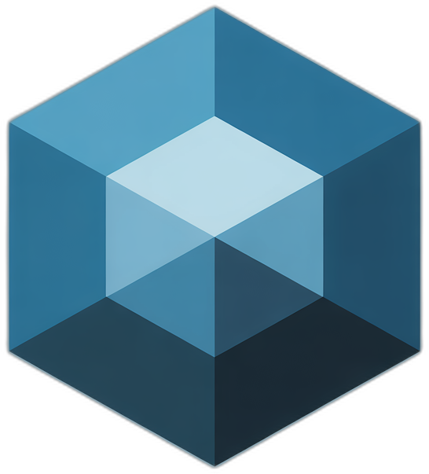
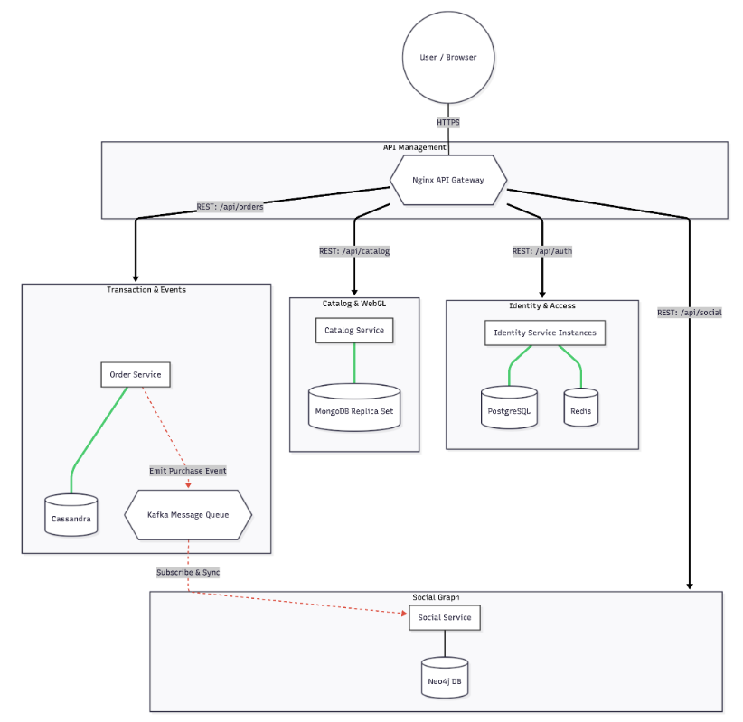
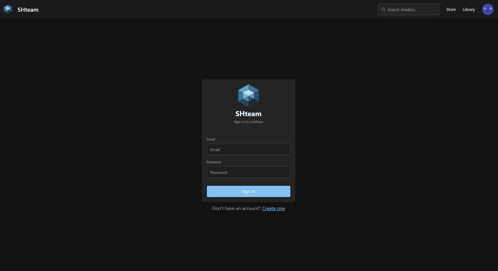
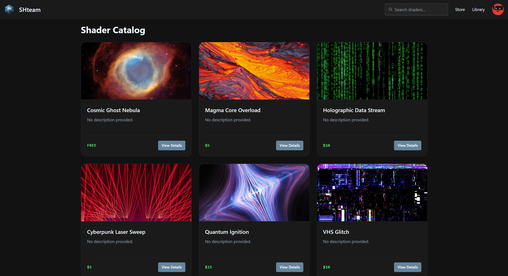
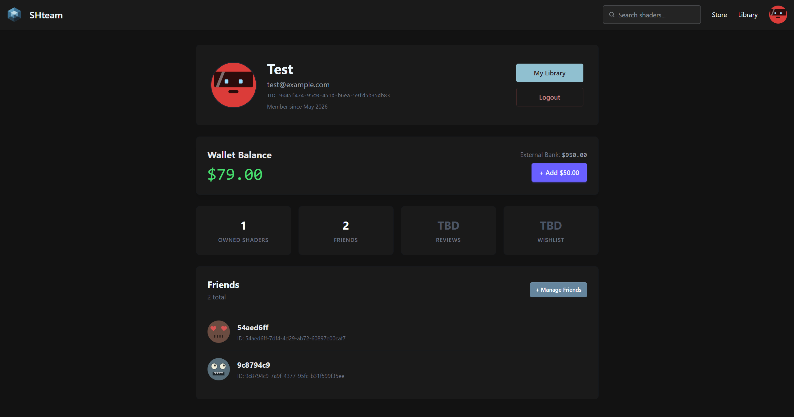
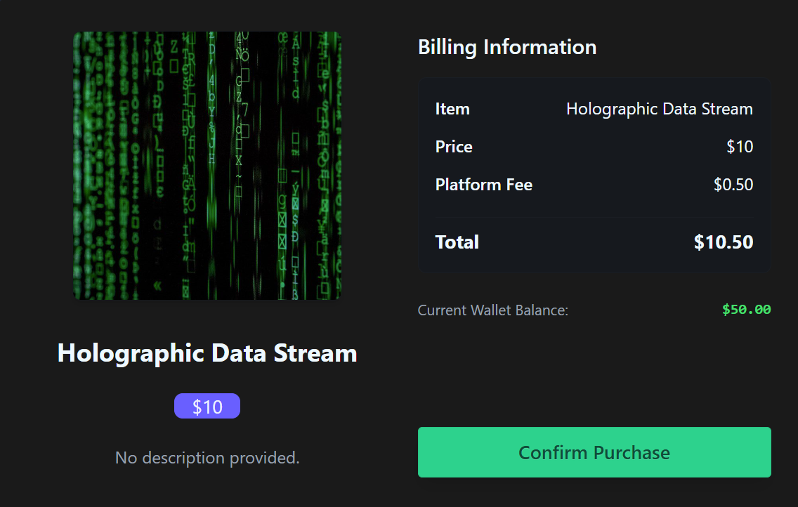
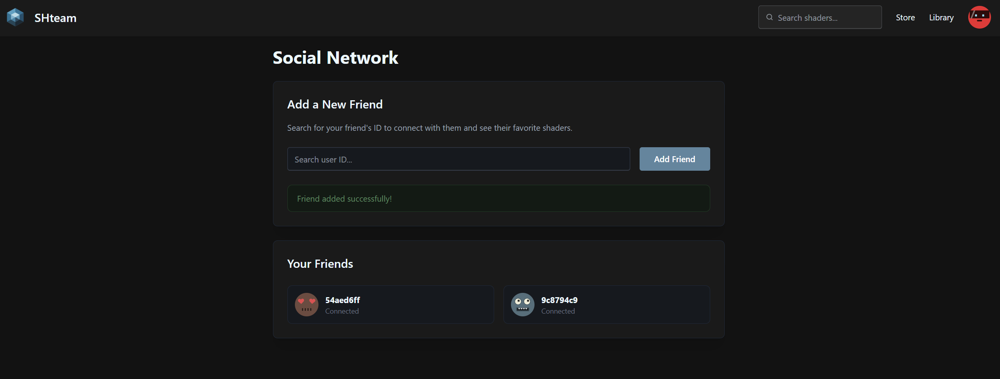
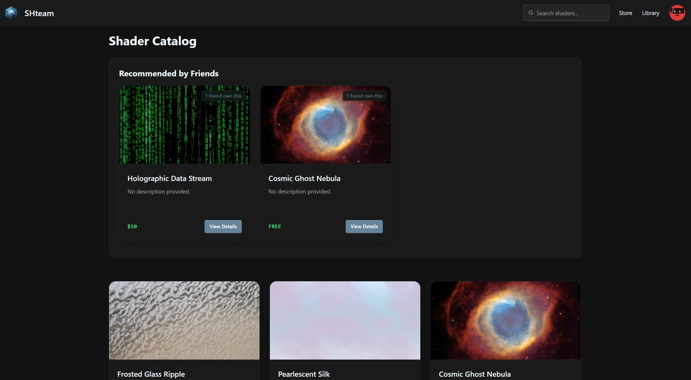

<div align="center">
  
  <p style="font-size: 50px; font-weight: bold; margin-top: 10px;">
    SHteam
  </p>
  <p style="font-size: 20px;">(Steam for Shaders)</p>
</div>

## Authors: Bilyi Andrii, Kyrylova Iryna, Shergina Oleksandra, Lushpak Viktoriia

SHteam is a specialized platform for discovering, testing, and collecting WebGL shaders. Think of it as Steam, but built specifically for graphics developers. Users can preview shaders in a live 3D environment, purchase them for their own projects, and interact with a community of creators.

## Technical Stack

- Common:

  

  

  

  

  

- Identity (Authentification) Service:

  

  

- Catalog Service:

  

  

  

  

- Order Service:

  

  

- Social Service:

  

## Architecture (Microservices)

- Identity Service: Handles authentication and profiles. Powered by NestJS, PostgreSQL (user data), and Redis (session management/failover).

- Catalog Service: Manages shader metadata and search using MongoDB for flexible storage of GLSL code.

- Order Service: Manages purchases and transaction history. Uses Kafka for asynchronous processing and Cassandra for fast event logging.

- Social Service: Manages user connections and recommendations. Built with Neo4j (GraphDB) to handle complex many-to-many relationships.

### Architectural Decisions

- Identity (Authentication) Service saves all user info (including password hash) in PostgreSQL. After login, the user is asigned with JWT token, expiration time = 1h. Users cannot access other pages apart from register/login if they do not have a token yet. After logout, token is deleted.

- Identity Service has 2 instances. When one fails/disconnects, requests are then navigated to the second alive instance. User data is saved, including session (token), no need to relogin.

- Nginx as API Gateway

- REST API

### Diagram



## Requirements

- Node >=22.15.1
- npm >=10.9.2
- Docker Compose

## How to Run

1. Run Docker:

```
docker-compose up --build -d
```

2. Access the platform:

- http://localhost:5173

### Identity service failover test

0. Log in.

1. Kill one of the identity services:

```
docker stop shteam-identity-1
```

2. Go back to the website - session should stay the same, so there will be no need to login again.

## Demonstration

1. Login page:



2. Catalog:



3. Profile:



4. Try out and buy shaders:




5. Add friends:



6. Get recommendations from your friends network:



## Responsibilities:

- **Bilyi Andrii**: develop the Three.js renderer for client-side GLSL execution, configure a 3-node MongoDB Replica Set with a read-only fallback mode during loss of quorum
- **Kyrylova Iryna**: design the Neo4j graph model, implemented a Kafka Consumer to sync successful purchases with the social graph
- **Shergina Oleksandra**: implement Kafka producers/consumers for asynchronous order processing, design the Cassandra schema for immutable transaction event sourcing
- **Lushpak Viktoriia**: configure Nginx for load balancing across redundant NestJS instances, implement the Auth Service integrated with PostgreSQL and Redis
